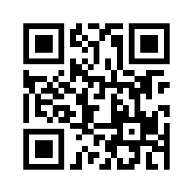
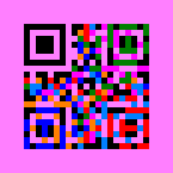
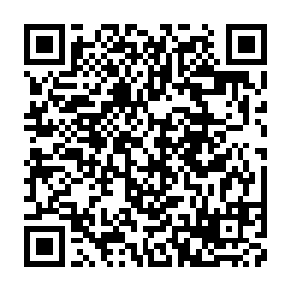

## Introducción a qrcode

La librería **qrcode** nos permite generar códigos QR.

Se puede instalar con pip:

```shell
pip install qrcode
```

Un **código QR** es un gráfico en dos dimensiones, que se puede usar para
codificar una cantidad relativamente grande de información (hasta 4k) en un
formato que se puede leer rápidamente. El gráfico consiste en bloques de color
negro dispuestos sobre una retícula cuadrada. Usando este formato podemos
codificar cualquier tipo de información.

Más información en la entrada [Código QR de la wikipedia](https://es.wikipedia.org/wiki/C%C3%B3digo_QR)

### Ejemplo de uso

Vamos a codificar el mensaje "Hola, Mundo" en un código QR:

```python
import qrcode

im = qrcode.make("Hola, Mundo cruel")
im.show()
```



**Ejercicio (opcional)**: Si tienes un lector de códigos QR en el móvil,
intenta leer el código de la celda anterior.

Esta imagen que obtenemos es una imagen de `Pillow`, así que podemos hacer con
ella todas las cosas que hacíamos con ella, como por ejemplo, obtener
información como su modo o su tamaño:

```python
import qrcode

im = qrcode.make("Hola, Mundo")
print(im.mode, im.size)
```

La salida debería ser:

```shell
1 (290, 290)
```

El valor de `Mode` `1` significa que solo ocupa un bit por cada pixel, es
decir, que es una imagen de negro y blanco en su sentido más absoluto; un pixel
solo puede ser blanco o negro, no existen tonos de gris.

Podemos también hacer un _resize_, por ejemplo:

```python
import qrcode

im = qrcode.make("http://www.python.org/")
im.show()
```


... Hacer arte moderno:

```python
from PIL import Image
import qrcode

im = qrcode.make("Hola, Mundo")
im = im.convert(mode="L")
im = Image.merge("RGB", (im, im.point(lambda x:x*0.5).rotate(90), im.rotate(-90)))
im.show()
```



O, por supuesto, salvarla a un fichero:

```python
import qrcode

im = qrcode.make("Hola, Mundo")
im.save("hola_mundo.png")
```

Podemos codificar cualquier tipo de información, no solo texto. Vamos,
por ejemplo, a codificar un diccionario:

```python
data = {
    'numero': 12345,
    'descripcion': "Caja tornillos 10mm",
    'precio': 2.22,
    'disponible': True,
}
im = qrcode.make(data)
im.show()
```



Como vemos, el código es bastante más grande, porque incluye más
información. Como curiosidad, comentar que los cuadros de las esquinas
sirven para que, al interpretarlo, se pueda orientar correctamente.

**Ejercicio**: Genera un código QR con tu nombre. Enviarlo por el chat
de Discord
