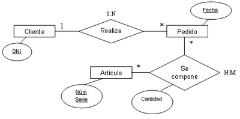
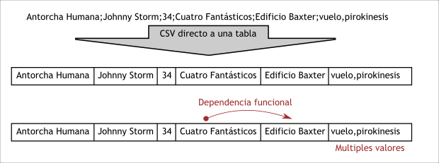
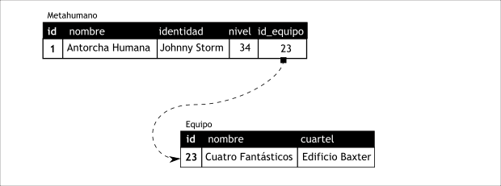
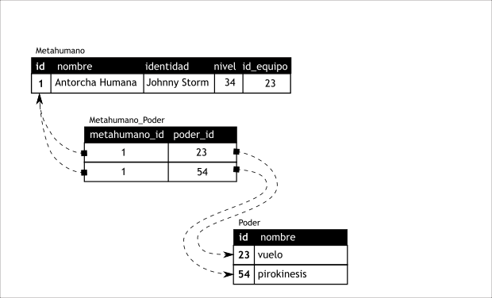
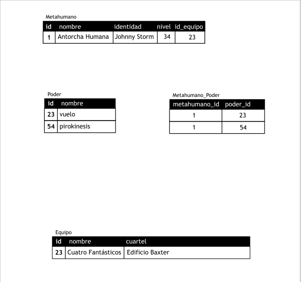
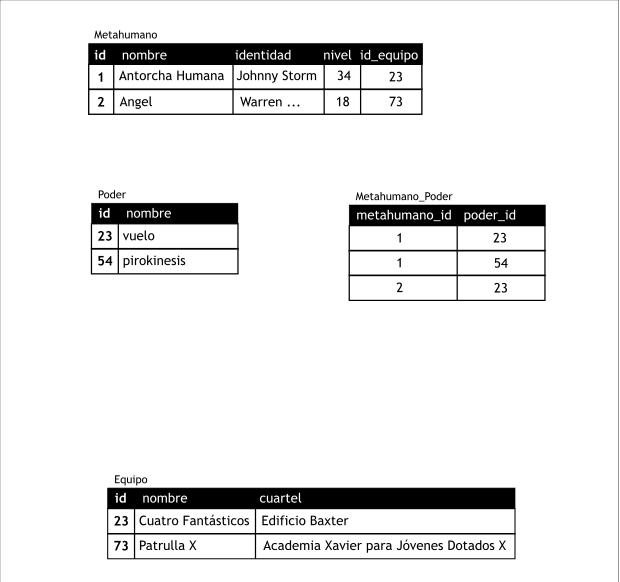
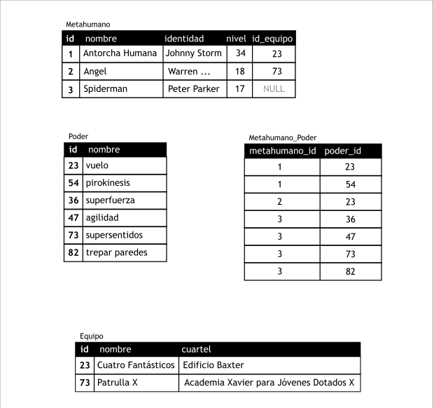
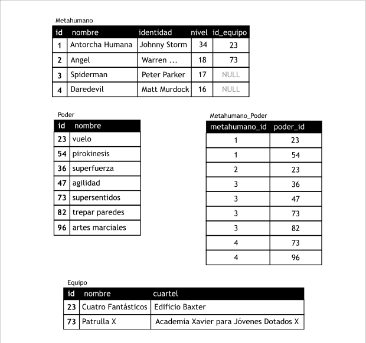

## Modelo de Entidad/Relación

Un modelo entidad-relación es una herramienta para el modelo de datos, la cual
facilita la representación de entidades de una base de datos. Fue definido por
[Peter Chen](https://es.wikipedia.org/wiki/Peter_Chen) en 1976.

En este modelo se trabajan con los siguientes conceptos:

- Entidades (Representadas con rectángulo)

- Atributos (Representados con elipses o circunferencias)

- Relaciones (Representadas por rombos)

Este es un ejemplo de un diagrama E/R:



### Entidad

Una __entidad__ Representa un objeto o concepto que queremos modelar, con
existencia independiente, es decir, se diferencia de otro objeto o cosa,
incluso siendo del mismo tipo. En un diagrama E/R se representa con un
**rectangulo**.

Algunos ejemplos:

- Una persona: se diferencia de cualquier otra persona, incluso siendo gemelos.

- Un automóvil: aunque sean de la misma marca, el mismo modelo, etc, tendrán atributos diferentes, por ejemplo, el número de chasis.

- Una casa: aunque sea exactamente igual a otra, aún se diferenciará en su dirección.

Una entidad puede ser un objeto con existencia física, como una persona, una
máquina, una estrella, etc. (entidad concreta); o un objeto con existencia
conceptual, como un cargo en una empresa, una asignatura, una habilidad, etc.
(entidad abstracta).

Una entidad está descrita y se representa por sus características o atributos.
Por ejemplo, una entidad Persona puede tener como características: Nombre,
Apellido, Género, Estatura, Peso, Fecha de nacimiento... Nosotros como
analistas seleccionaremos los atributos que queremos modelar.

### Atributos

Los **atributos** son las características que definen o identifican a una
entidad. Estas pueden ser muchas, y el diseñador utiliza o implementa las que
considere relevantes. En un diagrama de E/R se representan con una
**circunferencia** o una **elipsis**. Los atributos se unen con líneas a las
entidades a las que correspondan.

En un conjunto de entidades del mismo tipo, cada entidad tiene valores
específicos asignados para cada uno de sus atributos, de esta forma, es posible
su identificación unívoca.

Ejemplos:

A la colección de entidades *alumnos*, con el siguiente conjunto de atributos en
común, (id, nombre, edad, semestre), pertenecen las entidades:

    (1, Sophia, 15 años, 2)
    (2, Josefa, 19 años, 5)
    (3, Carlos, 20 años, 2)
    ...

Cada una de las entidades pertenecientes a este conjunto se diferencia de las
demás por el valor de sus atributos. Nótese que dos o más entidades diferentes
pueden tener los mismos valores para algunos de sus atributos, pero nunca para
todos.

En particular, los **atributos identificativos** son aquellos que permiten
diferenciar a una instancia de la entidad de otra distinta. Cualquier atrubuto
o conjunto de atributos que permita diferenciar cualquier entidad del resto de
ellas se denomina **clave candidata**.

Para cada atributo, existe un **dominio** del mismo, este hace referencia al
tipo de datos que será almacenado a restricciones en los valores que el atributo
puede tomar (cadenas de caracteres, números, solo dos letras, solo números
mayores que cero, solo números enteros...).

Cuando algún atributo correspondiente a una entidad no tiene un valor
determinado, recibe el valor nulo, bien sea porque no se conoce, porque no
existe o porque no se sabe nada al respecto del mismo.

### Relaciones

Una __relación__ Consiste en una colección, o conjunto, de relaciones de la
misma naturaleza. las relaciones se representan en los diagramas de E/R con un
**rombo**.

Ejemplo:

Dados los conjuntos de entidades "Habitación" y "Huésped", todas las relaciones
de la forma habitación-huésped, permiten obtener la información de los
huéspedes y sus respectivas habitaciones.

La dependencia o asociación entre los conjuntos de entidades es llamada
participación. En el ejemplo anterior los conjuntos de entidades "Habitación" y
"Huésped" participan en el conjunto de relaciones habitación-huésped.

Se llama grado del conjunto de relaciones a la cantidad de conjuntos de
entidades participantes en la relación.

Es importante hacer notar que todas las relaciones entre modelos deben
representarse con relaciones, y por tanto nunca sera posible tener una línea
que una directamente a un modelo con otro, siempre habrá de pasar por una
relación intermedia.

### Restricciones

Son las condiciones que sobligatoriamente han de cumplir las entidades y
relaciones de nuestro modelo.

**Correspondencia de cardinalidad**: Dado un conjunto de relaciones en el que
participan dos o más conjuntos de entidades, la cardinalidad de la
correspondencia indica el **número de entidades** con las que puede estar
relacionada una entidad dada.

Dado un conjunto de relaciones binarias y los conjuntos de entidades A y B, las
cardinalidades pueden ser:

* __Uno a Uno__: (1:1) Una entidad A se relaciona con solo una entidad B.
  (ejemplo dos entidades, profesor y departamento: si un profesor solo puede ser jefe
  de un departamento y un departamento solo puede tener un jefe).

* __Uno a N o Uno a Varios__: (1:N) Una entidad en A se relaciona con cero o más entidades
  B. Pero los registros de B solamente se relacionan con un registro en A.
  (ejemplo: dos entidades, vendedor y ventas: un vendedor puede tener muchas
  ventas pero una venta solo puede tener un vendedor).

* __N a 1 o Varios a 1__: (N:1) La inversa de la anterior. Una entidad A se relaciona
  exclusivamente con una entidad B. Pero una entidad en B se puede relacionar
  con 0 o más entidades en A (ejemplo empleado-centro de trabajo).

- **N a N o Varios a Varios**: (N:N) Una entidad A se puede relacionar con 0 o
  más entidades B, y viceversa. Por ejemplo la relación entre actores y
  películas: Los actores trabajan normalmente en varias películas, y en una
  película participan varios actores.

Chen propuso las siguientes reglas informales para mapear descripciones en
lenguaje natural a los conceptos usados en los diagramas E/R.

| estructura gramatical     |     | Concepto E/R                 |
|--------------------------:|:---:|------------------------------|
| Sustantivo                |  ⇆  | Entidad  ☐                   |
| Verbo transitivo          |  ⇆  | Relación ◊                   |
| Verbo intransitivo        |  ⇆  | Atributo ◯                   |
| Adjetivo                  |  ⇆  | Atributo ◯ (De una entidad)  |
| Adverbio                  |  ⇆  | Atributo ◯ (De una relacion) |

### Ejemplo 


Tu primera misión: Una página web con un listado de nombres de metahumanos
y su nivel de peligro.

La parte buena es que tenemos esa información en un fichero CSV:
Puedes descargar el fichero aquí: [superheroes.csv](superheroes.csv)

{{ read_csv('docs/superheroes.csv', delimiter=';') }}

Observando los datos del fichero, podemos sacar algunas conclusiones que nos
serán de ayuda:

- El delimitador es el carácter punto y coma

- La primera fila consiste en los nombres de las columnas

- En la primera columna tenemos el nombre

- En la tercera columna tenemos el nivel (de peligro)

Vamos a resolver los problamas de normalizacion. Si migraramos la tabla
directamente a partir de la estructura del fichero CSV, obtendriamos algo como
esto:



Podemos apreciar dos problemas en esta tabla: El primero es la dependencia
funcional entre el nombre del equipo y el cuartel general del mismo. Si
comprobamos los datos, veríamos que para cada valor diferente del equipo
(Patrulla X, Vengadores, Cuatro Fantásticos, etc.) tenemos exactamente el mismo
valor en la columna de cuartel general. Esto es una consecuencia de que cada
equipo tiene su propio cuartel general, como es lógico, y que el mismo equipo
no puede tener dos cuarteles generales. Hay que romper esa dependencia
funcional, ya que sabmos por experiencia que es una fuente de problemas
futuros.

El otro problema son los valores múltiples en la columna de los poderes. Esto
rompe con la primera forma normal, que nos exige -entre otras cosas- valores
únicos en cada atributo o columna.

Vamos a resolver primero el tema de la dependencia funcional. La solución es
**partir la tabla en dos**, de forma que tengamos una tabla para los metahumanos y otra
para los equipos. Agregamos una **clave primaria** (_Primary Key_) a cada una
de estas tablas, y para vincular a un metahumano a un equipo, añadimos una
nueva columna, que en el diagrama hemos llamado `id_equipo`, que contendrá el
valor de la clave primaria del equipo al que el heroe (o villano) está asociado. Cuando
ponemos el valor de la clave primaria de una tabla en otra tabla, se la llema
**clave foranea** (_Foreign Key_)



El segundo problema es un poco más complicado, porque tenemos una relación
**N a N**: Un metahumano puede tener más de un poder, y un poder puede ser
_compartido_ por varios metahumanos (O dicho de otra manera, varios metahumanos
pueden tener el mismo poder). La solución en estos casos es también partir la
tabla, crear una nueva tabla para los poderes, con su clave primaria, y luego
**crear una nueva tabla intermedia**, que contendrá tanto la clave primaria del metahumano
como la clave primaria del poder. 



Veamos como se van creando las tablas a medida que fueramos añadiendo entradas
desde el fichero CSV. Si crearamos por ejemplo a la Antorcha Humana, tendriamos
algo como:



Al añadir a El Ángel, nos vemos obligados a crear un nuevo equipo, pero
reutilizamos el poder de volar que ya habíamos definido para la antorcha:



Al añadir a _Spiderman_, como no está asociado a ningún equipo, podremos en su
clave foránea de equipo el valor especial `NULL`, equivalente más o menos al
`None` de Python pero en bases de datos. Eso si, tiene muchos poderes que no
habíamos visto antes, así que tanto la tabla de `Poder` como la tabla
intermedia `Metahumano_Poder` ganan nuevas entradas:



Al añadir a _Daredevil_, tiene dos poderes, pero solo uno que no habíamos visto
antes. Para los *supersentidos* usamos el que se creo previamente.




**Ejercicio**: Crear un nuevo projecto django, llamado `shield`, y dentro de él
una *app* para gestionar nuestro conocimiento de los metahumanos, llamada
``metahumans``.

Crear proyecto:

```shell
django-admin startproject shield
cd shield
```

Una vez dentro de la carpeta principal del proyecto, haremos una comprobación
para estar seguros de que todo está correcto:

```shell
python manage.py check
```

Ahora creamos una *app* para gestionar a estos superseres o metahumanos, la
llamaremos `metahumans`:

```shell
python manage.py startapp metahumans
```

Vemos que se ha creado una carpeta `metahumans`, dentro de la cual tenemos el
siguiente contenido:

```
metahumans
├── admin.py
├── apps.py
├── __init__.py
├── migrations
│   ├── __init__.py
├── models.py
├── tests.py
└── views.py
```

Como con `startproject`, lo único que ha hecho `startapp` es crearnos un
esqueleto de los ficheros y carpetas que necesitaremos para la vista. Todos
estos ficheros están vacios o con apenas una o dos líneas.

Una cosa importante: **Aunque `startapp` nos haya creado el código mínimo
para una *app*, esta es invisible para el proyecto Django en si, hasta que
no se la incluya en la variable `INSTALLED_APPS` dentro del archivo
`settings.py`**.

*Ejercicio*: Incluir `metahumans` en la lista de apps en uso del proyecto.
Editar `shield/settings.py'.
