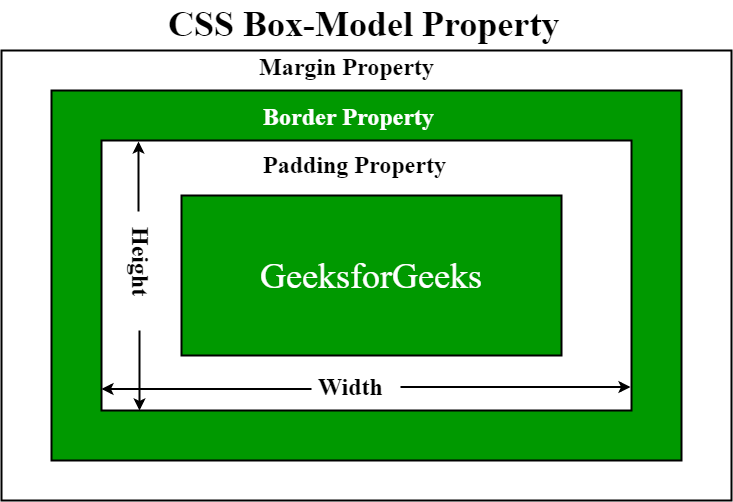

## Apéndice 2: CSS

El objetivo de las **Hojas de Estilo en Cascada** (*Cascade Style Sheets*) es
poder definir todos los aspectos visuales de la representación de un
documento HTML de forma independiente y aislada de la representacion HTML
en si, que quedaria unicamente para definir la semántica. Es decir, en HTML
especificamos que un determionado fragmento de texto es un parrafo (con
la etiqueta `p`) y  con CSS definimos todos los aspectos estéticos o de
representación: Tipo de letra, tamaño, orientación, color, alineación, etc.

Para ver un buen ejemplo de lo que se puede conseguir cambiando la
especificacion de estilos para un mismo documentos, la página [CSS Zen
garden](http://csszengarden.com/) es realmente recomendable.

Existe tres maneras de especificar el estilo o representación de nuestro HTML:

- Usando estilos en línea

- Usando una especificación interna

- Usando una referencia a un documento CSS externo


### Especificar estilos en línea

Este forma de aplicar estilos es la más directa pero es la menos recomendable.
Veremos después la especificación mediante una especificación interna (que es mejor)
o usando referencias a documentos externos (Que es todavía mejor).

Usando estilos en línea se limita la definición del estilo al elemento concreto
en el que lo estamos definiendo. Aunque no se recomienda su usa, es la forma
más sencilla y además, los elementos definidos en linea tiene precedencia sobre
las definiciones hechas es especificaciones internas o por referencia, lo cual
puede ser necesario en algunos casos. Pero hay que tener en cuenta que estos
suele ser sintoma de un problema de diseño que estamos parcheando, pero no
arreglando.

En el siguiente ejemplo vamos a cambiar todas estas caracteríisticas en el
único párrafo de texto que hay en el documento:

 - Cambiaremos el color a verde
 
 - Usaremos la tipografía `Trebuchet MS` (Si el ordenador no tuviera
   esa tipografia disponible, usa la que tenga por defecto dentro 
   de la familia *sans-serif*.
 
 - El tamaño del texto se ajustará a 25 pixels de alto.

Veamos cómo se haría usando estilos en línea:

```html
<html>
 <head>
  <title>Ejemplo de CSS</title>
 </head>
 <body>
  <p style="color: green; font-size: 25px; font-family: 'Trebuchet MS', sans-serif;">
    Hello CSS World
  </p>
 </body>
</html>
```

**Ejercicio**: Añade un segundo parrafo, sin estilos, después del primero.
Comprueba que el estilo definido dentro del primer párrafo no se aplica al
segundo.

Esta forma de especificar los estilos tieme varios problemas:

- Tenemos que repetir todo la especificación del estilo cada vez que queramos
   usarlo

- Esto no solo hace la página más pesada, también gastamos tiempo de CPU en
  recalcular una y otra vez el mismo estilo.

- La gestión de los estilos se complica. Si tenemos 22 parrafos como el del
  ejemplo, y queremos cambiar el tamaño de la fuente a 32 pixels, hay que
  cambiar el estilo en cada uno de ellos.

- La Información de representacion (CSS) y la semántica están mezcladas en el
  elemento.

### Especificar los estilos de forma interna

Podemos usar las etiquetas `<style>` y `</style>` dentro de un documento HTMl
para definir los estilos a usar en el resto de la página. Este elemento debe ir
dentro de la sección `<head>` del documento.

```html
<html>
 <head>
  <style>
    p {
        color: green;
        font-size: 25px;
        font-family: 'Trebuchet MS', sans-serif;
    }
  </style>
 </head>
 <body>
  <p>Hello CSS World</p>
 </body>
</html>
```

En esta definición obtenemos algunas ventajas. Al definir los atributos de un
párrafo de esta manera, estamos especificando todos los párrafos, de forma que
no tenemos que repetir la misma información en cada elemento de la página.

**Ejercicio**: Añadir un nuevo párrafo. Comprobar que el nuevo párrafo mantien
las características definidas en la hoja de estilo. 

Además, aunque esten en el mismo documento, por los menos hemos separado la
especificación de los estilos y el documento. Esto hace
también que los estilos se calculen solo una vez.

### Especificar una hoja de estilos como un documento externo

Este es la forma más recomendable de aplicar estilos a un documento. Para ello
se usa la etiqueta `link` dentro de la estructura `head` del documento. Usamos
el atributo `rel` con el valor `stylesheet` dentro del `link`, y el atributo `href`
debe enlazar con el documento que contenga las reglas de estilo:

    <html>
    <head>
    <link rel="stylesheet" type="text/css" href="style.css">
    </head>
    <body>
     <p>Hello CSS World</p>
    </body>
    </html>


Las ventajas de tener el estilo definido en un documento externo son:

- Podemos reutilizar esta hoja de estilo en otros documentos HTML

- Podemos enlazar a varias hojas de estilo desde un único documento.

- Estas hojas de estilo se pueden cachear. Por ejemplo si definimos
  una hoja de estilos comun para todo un website, solo se cargará la
  primera vez.

- No mezclamos los dos lenguajes en un mismo documento

Por ejemplo:

```html
<html>
 <head>
  <link rel="stylesheet" type="text/css" href="estilos.css">
 </head>
 <body>
  <p>Hello CSS World</p>
 </body>
</html>
```

Siendo el documento `estilos.css` el siguiente:

```css
p {
    color: green;
    text-decoration: underline;
    font-size: 25px;
    font-family: 'Trebuchet MS', sans-serif;
}
```


La razón de definir los estilos en la parte `head` es que permite al navegador
obtener la información necesaria para la representacion de los elementos antes,
de forma que puede usar la para no tener que representar el elemento dos veces,
lo que resulta molesto para el usuario y hace aparentemenete más lenta la carga
de la página.


### Estructura de un documento CSS

Los documentos CSS consisten en una serie de **reglas** (*rules*) que define
como se debe representar un elemento o subconjunto de elementos. La estructura
de las reglas siguen el siguiente patrón:

    <selector> { <propiedades> }

El selector es el que determina a que elementos de la página se le deben
aplicar las propiedades definidas en la regla. Hasta ahora hemos usado uno 
muy sencillo que es simplemente el nombre de un tag; en nuestro caso `p`. Este
seria el caso mas sencillo para un selector.

**Ejercicio**: Escribe una regla para los elementos `H1` que les asigne color
rojo.

Podemos tener multiples selectores en la misma regla, por ejemplo la siguiente
regla define que la alineacion del texto para los elementos `h1` y `h2` debe
hacerse centrada:

```css
h1, h2 {
    text-align: center;
    }
```

Las propiedades normalmente consisten parejas atributo/valor, separados por el
carácter dos puntos: `:`, como en el ejemplo anterior. Normalmente se definen
varios atributos, pero no es obligatorio; el ejemplo anterior, in ir más lejos,
solo define una propiedad.

Los selectores pueden ser más elaborados que simplemente la etiqueta: veamos
algunos selectores básicos en forma de ejemplos:

Ejemplo     | Descripción del selector|
-----------:|-------------------------|
`*`       | Universal. Todos los elementos |
`div`     | De etiqueta. Todos los elelmento `div` |
`.blue`   | De clase: Todos los elementos que tengan la case `blue` |
`#headline` | De identidad: **El elemento** con identificador `headline` |
`[attr]`    | De atributo: Elementos que tengan el atributo indicado (con cualquier valor)|
`[attr='val']` | De atributo: Elementos con el atributo y el valor indicado |
`[attr~='val']` | De atributo: Elementos con el atributo y **contengan** valor indicado |
`[attr*='val']` | De valor de atributo: Elementos que tengan el atributo y el valor indicado |
`:pseudo-class` | De pseudoclase: Todos los elementos con la pseudoclase indicada |
`div > p` | De descendencia: Todos los párrafos que estén **directamente** dentro de un `div` |
`div p` | De descendencia: Todos los párrafos que estén dentro de un `div` (Al nivel que sea)|


**Ejercicio**: Modificar la vista de la lista de superheroes. Hacer que el
texto de nivel peligroso aparezca en rojo y en negrita (la propiedad para
poner el texto en negrita es: `font-weight: bold;`. Podemos asignar una clase a
un elemento html usando el atributo `class`. Por ejemplo, el párrafo:

    <p class="saludo">Hola, mundo</p>

Tiene la clase `saludo`. Podriamos definir los estilos para esta clase de
parrafos con el selector `p.saludo`.

Nota: También es posible asignar varias clases a un unico elemento, simplemente
hay que ponerlos como una lista de clases separados por coma. El siguiente
ejemplo muestra un parrafo con las clases `saludo` y `aviso`:

    <p class="saludo aviso">Hola, mundo</p>


## Pseudo-clases

Las psuedo-clases son palabras clave que nos permite seleccionar elementos
basándonos en información que no está en el documento (y por tanto no es
accesible en el DOM) o que no puede ser accesible usando los selectores
anteriores. Esta información puede estar asociada a cierto
estado, a localizaciones, a negaciones de lo anterior o a lenguajes.

El ejemplo más claro de las pseudoclases es el referido a los enlaces, tenemos
una pseudoclass `:visited` para los enlaces que ya han sido visitados, otra
para cuando el puntero del ratón está situado encima del enlace y podemos,
por tanto, hacer click en él, `:hover`. Otros casos muy usados son seleccionar 
un checkbox cuando esta seleccionado, `:checked`, o seleccionar el elemento de
un formulariuo que tenga el foco, ':focus'.


### Selector por identidad

Para especificadar el identificador de un elemento en HTML se usa la propiedad
`id`. En el selector, como vimos antes, usariamos el prefijo `#`: 

```html
<div id="ejemplo">
    <p>Esto es un texto de ejemplo</p>
</div>
```

Que podria ser seleccionado con:

```css
#ejemplo {
 width: 20px;
}
```

La especificación de HTML no permite que múltiples elementos tengan el
mismo ID.

Algunas propiedades útiles:

- `border`: `border: 1px dotted red;`

- `background`: 
 
 - `background-color: red;`

 - `background-color: #de1205`;

 - `background-color: rgba(0, 0, 0, 0.5);`

 - `background-image: url(logotipo.png);`

### Box model



#### Ajustes de tipografía

Con `font` podemos definir casi todos los aspectos tipograficos: POdemos usar
la abreviatura `font` para definir cada uno de las siguietes caacteríisticas,
por orden:

- `font-family`
- `font-size`
- `font-stretch`
- `font-style`
- `font-variant`
- `font-weight`
- `line-height`


